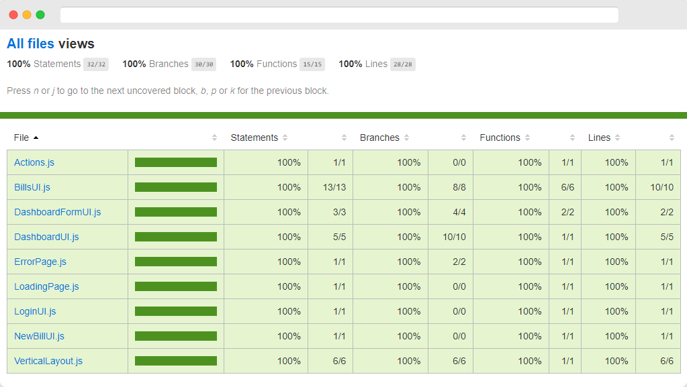
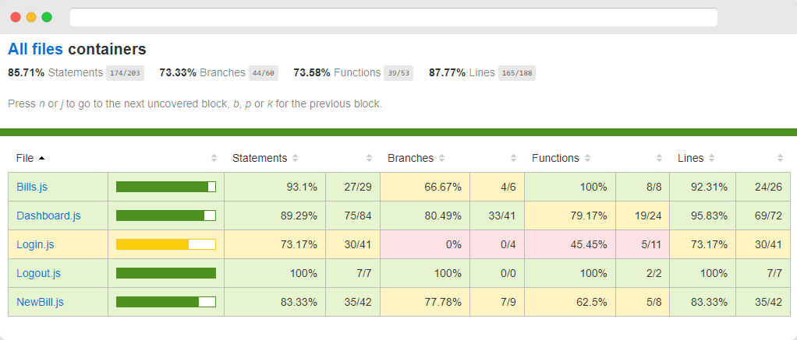

# Billed

> [!CAUTION]
> This repository hosts a project completed as part of my [OpenClassrooms](https://openclassrooms.com) training program. Having successfully completed the program, the project has now been archived and will no longer be actively maintained. Please be aware that while the repository will remain accessible for reference, some links or features may no longer function as intended.

## Overview

The objective of this project was to fix a series of bugs (listed [here](https://github.com/alexperronnet/openclassrooms-p9-billed/issues?q=is%3Aissue+is%3Aclosed)), to improve the test coverage and to realize an End-to-End test case.

I usually push projects to the max but to be honest this project was not interesting at all for a multitude of reasons so I preferred to do only what was asked so I could quickly move on.

### Why didn't I like this project?

- The project was not well documented
- The project was not well structured
- The project use a lot of deprecated packages
- The project use bootstrap and jQuery 🤢
- The UI is not responsive
- The UI is not accessible
- I think that write tests for code built by someone else is a waste of time.
- I think that write tests after building a project is not a good practice.
- I prefer to write tests for code that I wrote myself, especially if the project was to learn testing.

## Local Setup

> U can find the original front [here](https://github.com/OpenClassrooms-Student-Center/Billed-app-FR-Front) & back [here](https://github.com/OpenClassrooms-Student-Center/Billed-app-FR-back)

### Clone the repository

```bash
git clone https://github.com/alexperronnet/openclassrooms-09-billed
```

### Navigate to the project folder

```bash
cd openclassrooms-09-billed/billed-front
```

```bash
cd openclassrooms-09-billed/billed-back
```

### Install dependencies

```bash
npm install
```

> You need to install the dependencies for both the front and the back

### Run the back

```bash
npm run run:dev
```

### Run the front

```bash
live-server
```

> You need to install liver-server globally with `npm install -g liver-server` and go to `http://127.0.0.1:8080/`

## Tests

### Run all tests

```bash
npm run test
```

### Run a single test

```bash
jest <path-to-test-file>
```

## Coverage

### All files


### Views



### Containers



## License

This is an OpenClassrooms project. The code is freely reusable, but assets (images, videos and logo) are not because they are not mine.

If you are also a student of OC, you can freely use my work as inspiration, but I advise you not to copy parts of it.
